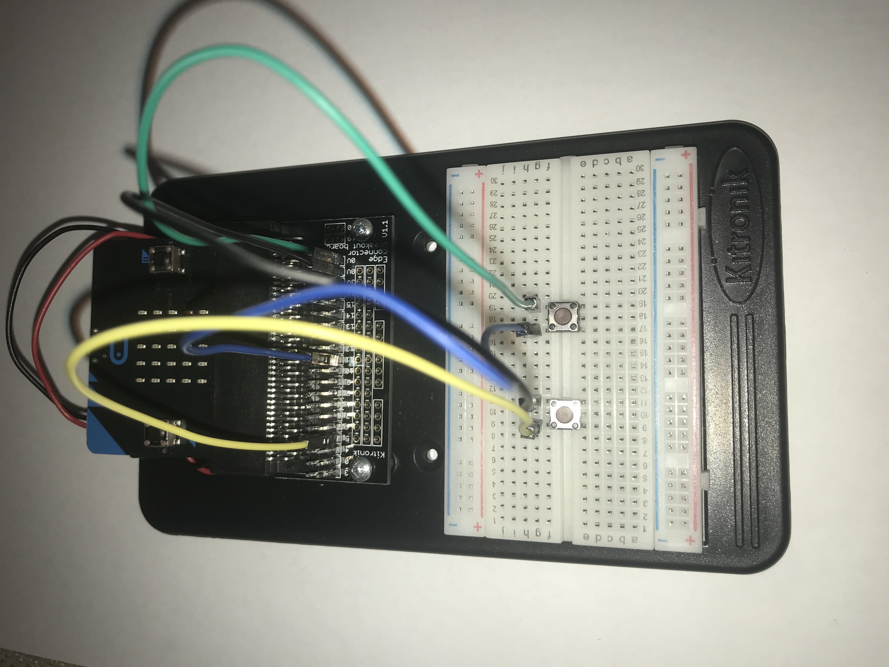
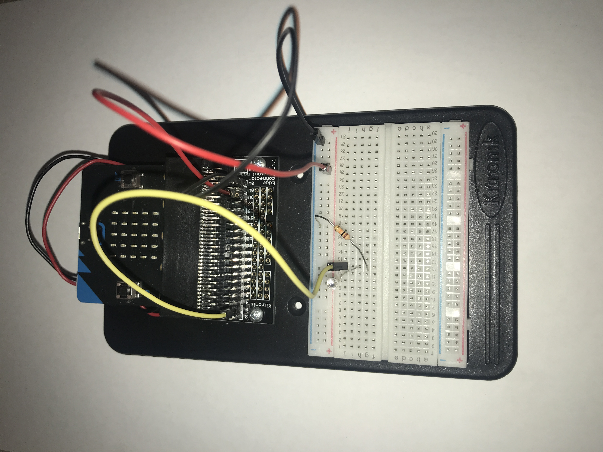
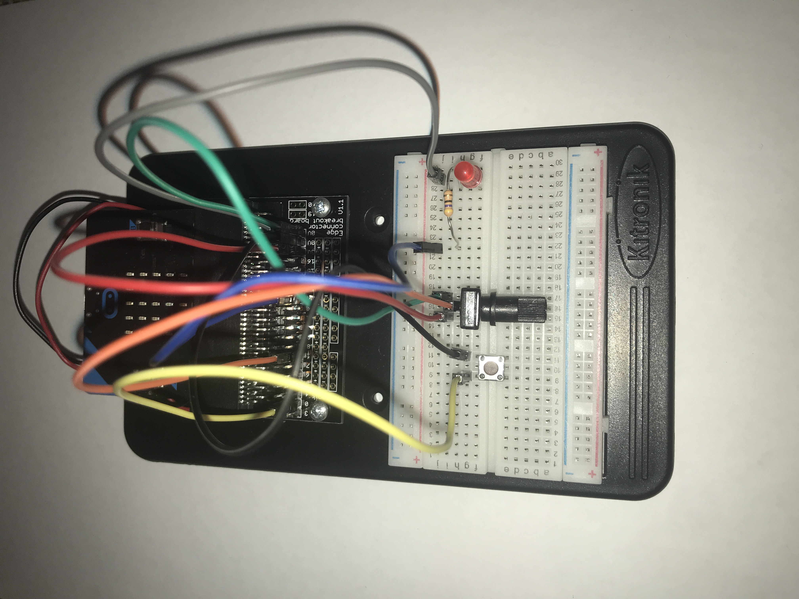
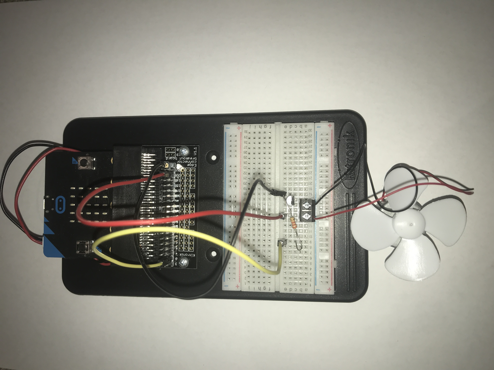
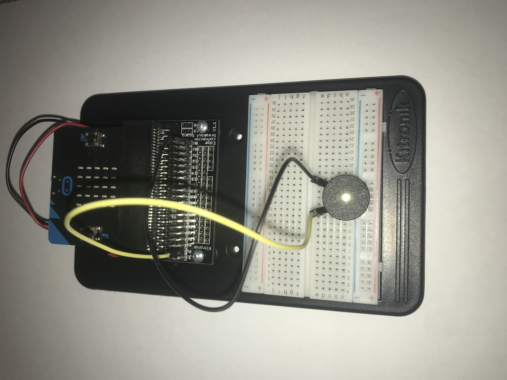

# Inventor Kit Experiments

*Markdown reference: https://guides.github.com/features/mastering-markdown/*

### Say "Hello" to the BBC micro:bit ###

#### Photo of completed project ####

(micro:bit experiment 1)

#### Reflection ####

In this experiment, the micro:bit itself was new to me. As the first project I completed on the micro:bit, every element of the process was new to me- including the coding and making connections on the breadboard. I ultimately learned the basics on how to work the micro:bit and where to access resources to help with coding or fabrication.

This experiment could be the basis of a real world application such as signs that use LED's. The text that is displayed can be easily changed and could be useful as road signs or notice boards.

### Using a Light Sensor & Analog Inputs ###

#### Photo of completed project ####

(micro:bit experiment 2)

#### Reflection ####

In this experiment, I first started to learn about the phototransistor and resistors. As more light shines on the phototransistor this allows more current to flow and then increases the voltage towards 3V. When there is less light, the resistor helps pull the voltage down to 0V.

This experiment could be the basis of a real world application such as interactive displays using LED's or a sensor telling if it is light or dark outside.

### Dimming an LED using a Potentiometer ###

#### Photo of completed project ####

(micro:bit experiment 3)

#### Reflection ####

In this experiment, something that was new to me was the potentiometer and the process of connecting it to an LED. Something that I learned was that that the LED must have the flat side facing a particular way in order to work, like how the resistor must face a certain way. 

This experiment could be the basis of a real world application such as house lights and their on and off switches and ability to dim.

### Using a Transistor to Drive a Motor ###

#### Photo of completed project ####

(micro:bit experiment 4)

#### Reflection ####

In this experiment, something I learned was how a transistor works as a new micro:bit element.

This experiment could be the basis of a real world application such as a small, hand-held fan or motorised device that spins. Many elecrical devices do use a motor in some way, whether this is to spin something or as a power source.

### Setting the Tone with a Piezo Buzzer ###

#### Photo of completed project ####

(micro:bit experiment 6)

#### Reflection ####

In this experiment, something I learned was how to set up a buzzer with the micro:bit. I also learned the importance of ensuring that all wires are connected in the correct places as the first time I built the project one of the wires was not in the correct position, resulting in the project not to work at all. Something that was new to me was the piezo buzzer as this was the first project that I actually used it.

This experiment could be the basis of any real world applications that use a buzzer, such as game timers, or basic music making.

