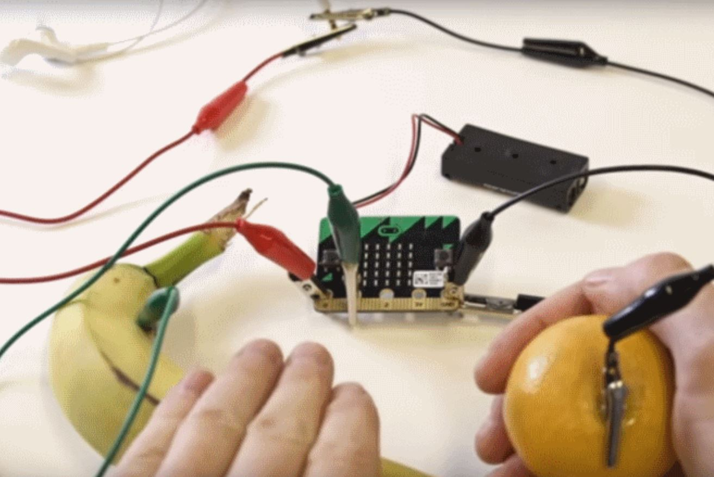

# Assessment 1: Replication project

*Fill out the following workbook with information relevant to your project.*

*Markdown reference:* [https://guides.github.com/features/mastering-markdown/](http://guides.github.com/features/mastering-markdown/)

## Replication project choice ##
Guitar

## Related projects ##
*Find about 6 related projects to the project you choose. A project might be related through  function, technology, materials, fabrication, concept, or code. Don't forget to place an image of the related project in the* `replicationproject` *folder and insert the filename in the appropriate places below. Copy the markdown block of code below for each project you are showing, updating the number* `1` *in the subtitle for each.*

### Related project 1 ###
micro:bit Magnet Theremin

https://www.youtube.com/watch?v=y2gqNtakBHo

This project is related to mine because of the similar concept of using a movement to manipulate a sound. With the theremin, a magnet is used to change the pitch of the noise made by the micro:bit, and with my replication project of the guitar, the movement of the micro:bit itself changes the tempo of the noise.

### Related project 2 ###
micro:bit Air Guitar

https://make.techwillsaveus.com/microbit/activities/air-guitar

This project is related to my guitar project due to the similar technology, concept and coding. Though the fabrication of this project and the original micro:bit guitar my project is based on are quite similar. This project also uses the acceleration function of the micro:bit though it alters the volume of the guitar, rather than the tempo. Both projects can be interacted with similarly, with the acceleration manipulating sound in some way.

### Related project 3 ###
micro:bit Music Maker

https://www.elecfreaks.com/store/blog/post/make-a-music-machine-with-elecfreaks-microbit-tinker-kit.html

This project is related to mine because of its similar technology, concept and coding. The music maker uses an extention kit that provides a wider variety of notes. Rather than continuously producing notes like my project, the music maker has a different note set for each button. Though the projects produce noise differently, the end products are similar.

### Related project 4 ###
micro:bit Instrument Tuner

https://www.kitronik.co.uk/blog/bbc-microbit-as-an-instrument-tuner/

This project uses similar technology and coding to my project. Using the buttons, the tuner will play various notes to help someone tune an instrument, where as with my project, a note will be continuosly played until turned off. 

### Related project 5 ###
micro:bit Banana Keyboard

https://makecode.microbit.org/projects/banana-keyboard

This project is related to mine because of the similar technology. Instead of a continuous noise like the guitar project, the banana keyboard only produces noise by pressing the connected fruit. The two projects use similar items to complete circuits such as foil to turn it on and off and some sort of buzzer/ speaker.

### Related project 6 ###
micro:bit Alarm

https://www.kitronik.co.uk/blog/microbit-alarm-kitronik-university/

This project uses similar technology as mine where the micro:bit is programed to activate a buzzer when movement is detected. Although, with the alarm there is no variation on the pitch or tempo of the noise made. The project does use similar parts of the micro:bit and code to activate the accelerometer.

## Reading reflections ##
*Reflective reading is an important part of actually making your reading worthwhile. Don't just read the words to understand what they say: read to see how the ideas in the text fit with and potentially change your existing knowledge and maybe even conceptual frameworks. We assume you can basically figure out what the readings mean, but the more important process is to understand how that changes what you think, particularly in the context of your project.*

*For each of the assigned readings, answer the questions below.*

### Reading: Don Norman, The Design of Everyday Things, Chapter 1 (The Psychopathology of Everyday Things) ###

*What I thought before: Describe something that you thought or believed before you read the source that was challenged by the reading.*

Previously, I had never fully considered the importance of the design of a project. I did realise how important the final project was but not all the questions that had to be answered in the process such as whether how to use it is obvious, or what ways different people may react to it.

*What I learned: Describe what you now know or believe as a result of the reading. Don't just describe the reading: write about what changed in YOUR knowledge.*

I learned about the more indepth, or unseen parts of designing process. I started to realise how much design and efficiency impact one another, an object couuld be very efficient and complete a certain task well, but if the user does not understand how it works, the project becomes useless.

*What I would like to know more about: Describe or write a question about something that you would be interested in knowing more about.*

Something I would be interested to learn more about is human interaction with design. There are many assumptions when designing an object such as that the user should have an idea of how certain items work. Where do these assumptions end? What technology/ objects are assumed to be known by the user and what is new territory?

*How this relates to the project I am working on: Describe the connection between the ideas in the reading and one of your current projects or how ideas in the reading could be used to improve your project.*

The connection I believe is between the reading and my project is the human-centered design. Though the project makes complete sense to me as the designer because I fully understand the technology behind it, it may be more complex to a user who has no background knowledge of the micro:bit. This is something I need to consider when designing the project.

### Reading: Chapter 1 of Dan Saffer, Microinteractions: Designing with Details, Chapter 1 ###

*What I thought before: Describe something that you thought or believed before you read the source that was challenged by the reading.*

Before reading the source, I believed that interactions had to be large, and a focus element of a project. 

*What I learned: Describe what you now know or believe as a result of the reading. Don't just describe the reading: write about what changed in YOUR knowledge.*

After this reading I came to the understanding that interactions can be small and not a focus element, though they are still important and should be considered to create a superior user experience. Users can be led to interact with your project with their intuition, like Dan's example of the toaster.

*What I would like to know more about: Describe or write a question about something that you would be interested in knowing more about.*

I would be interested to learn of ways to measure the level of the interaction and see the changes it has the user experience in order to understand the most effective ways to create interactions.

*How this relates to the project I am working on: Describe the connection between the ideas in the reading and one of your current projects or how ideas in the reading could be used to improve your project.*

This reading helped me understand the methods of interation I would like to include in my project, and to play on users natural instinct to pick it up and move it around. I also have chosen to keep the design of the project as simple as possible to avoid over complicating the project.

### Reading: Scott Sullivan, Prototyping Interactive Objects ###

*What I thought before: Describe something that you thought or believed before you read the source that was challenged by the reading.*

Previously, I had never fully considered how much trial and error goes into developing something, no matter how simple it may be. The amount of change and development that goes into a project before the final prototype is complete was very interesting to see.

*What I learned: Describe what you now know or believe as a result of the reading. Don't just describe the reading: write about what changed in YOUR knowledge.*

As a result of the reading, I learned how much trial and error is involved in the development of a project. The final fabrication of a project may evolve into something completely different to what was originally intended.

*What I would like to know more about: Describe or write a question about something that you would be interested in knowing more about.*

I would like to learn more about the process of prototyping a project and how it is tested in the initial stages of development. I would also be interesting in learning more about what factors during a projects development will alter or evolve the design of the project.

*How this relates to the project I am working on: Describe the connection between the ideas in the reading and one of your current projects or how ideas in the reading could be used to improve your project.*

This relates to the project I am working on as it shows the necessity to have the project tested my multiple people are recieve feedback on its design and functionality. It also shows how much a project can change from an initial idea, and not to get stuck in one idea.

## Interaction flowchart ##
*Draw a flowchart of the interaction process in your project. Make sure you think about all the stages of interaction step-by-step. Also make sure that you consider actions a user might take that aren't what you intend in an ideal use case. Insert an image of it below. It might just be a photo of a hand-drawn sketch, not a carefully drawn digital diagram. It just needs to be legible.*

## Process documentation

*In this section, include text and images that represent the development of your project including sources you've found (URLs and written references), choices you've made, sketches you've done, iterations completed, materials you've investigated, and code samples. Use the markdown reference for help in formatting the material.*

*This should have quite a lot of information!*

*There will likely by a dozen or so images of the project under construction. The images should help explain why you've made the choices you've made as well as what you have done. Use the code below to include images, and copy it for each image, updating the information for each.*

Initial Product Design

Testing the accelerome

Testing the light sensor

Fabrication

Final Product

## Project outcome ##

### The Spaceship ###

### Project description ###

The Spaceship is a compact music making device. Intended for the sole purpose of amusement, the Spaceship is easy to use by people of all ages.

### Showcase image ###

### Additional view ###

### Reflection ###

*Describe the parts of your project you felt were most successful and the parts that could have done with improvement, whether in terms of outcome, process, or understanding.*

The main part of the project that I believe needs improvement is the presentation of the final concept. I feel if I had spent less time on other aspects of the task, and overthinking the fabrication, I would have had more time to test various ways of presenting the project. Another element that could have been improved is the overall understanding of the micro:bit and its functions, with this understanding I could have improved on simple things such as making more stable connections and making the final project run as efficient as possible. I do believe that the overall functionality of the project is successful as it does work how I imagined it would. As well as this, I do feel that the concept for fabriction was successful, though it could have been improved physically.

*What techniques, approaches, skills, or information did you find useful from other sources (such as the related projects you identified earlier)?*

I mainly used the micro:bit website and the original guitar fabrication as the main sources in building this project, technology wise. When trying to figure out the best way to physically build the project I reflected on several sources that I have seen throughout the previous weeks of the course, such as relevant projects and the readings. Though the original micro:bit code was the most useful as it allowed for the understanding of how the code was supposed to function and a deeper understanding of all the elements that were brought together for the final project.

*What ideas have you read, heard, or seen that informed your thinking on this project? (Provide references.)*

The final shape of the project was inspired by the 1977 film, CLose Encounters of the Third Kind.

https://www.youtube.com/watch?v=S4PYI6TzqYk (Film Clip Link)

Don Norman's *The Design of Everyday Things* was useful in learning how the user needs to be considered when designing a project, and ensuring that it usable and simple to understand.

http://pages.ucsd.edu/~mboyle//COGS1/readings/Norman-COGS1-The%20Psychopathology-of-Everyday-Things.pdf (Chapter Link)

Both the direct project description and the related projects helped inform my thinking on this project. The direct project description was helpful with understanding the technology and how it was intended to function. The related projects were used to understand and discover new ways to use the same technology.

https://makecode.microbit.org/projects/guitar (Original micro:bit Project)

https://www.kitronik.co.uk/blog/bbc-microbit-as-an-instrument-tuner/ (Related Project)

https://www.elecfreaks.com/store/blog/post/make-a-music-machine-with-elecfreaks-microbit-tinker-kit.html (Related Project)

*What might be an interesting extension of this project? In what other contexts might this project be used?*

An interesting extention of this project could be creating more range in pitch, or even adding the ability to play different notes. The project could also be mad more enticing by the addition of multiple devices so that a group could all use them at the same time and create music. I can also see this device being created on a larger scale where more significant movements can be made by users, this could be seen in the setting of a gallery or a public display for anyone to use. Although I do believe that the only context this project would be used is for entertainment.
